# AGENTS.md

## Que es este repo

Laboratorio educativo de malware en Python. 14 modulos independientes que simulan amenazas reales en un entorno controlado, cada uno con simulacion, defensa y documentacion academica.

## Estructura

```mermaid
graph
  root("malwares/")
  root --> core["core/\n(Utilidades compartidas DRY)"]
  core --> init["__init__.py"]
  core --> common["common.py\n(log, colores, traversal, hashing, cleanup)"]
  core --> lab_setup["lab_setup.py\n(Generador unico de archivos de prueba 12 archivos)"]
  core --> cli["cli.py\n(CLI por comandos)"]
  core --> tui["tui.py\n(TUI con Textual — layout flexbox reactivo)"]
  root --> modulos["modulos/\n(14 amenazas)"]
  modulos --> rans["01_ransomware/\n(Cifrado XOR + nota de rescate)"]
  modulos --> wiper["02_wiper/\n(Corrupcion de archivos)"]
  modulos --> keylogger["03_keylogger/\n(Captura de pulsaciones simulada)"]
  modulos --> worm["04_worm/\n(Auto-replicacion entre directorios)"]
  modulos --> trojan["05_trojan/\n(Disfraz + payload oculto)"]
  modulos --> backdoor["06_backdoor/\n(C2 simulado + persistencia)"]
  modulos --> rootkit["07_rootkit/\n(Ocultacion de archivos/procesos)"]
  modulos --> botnet["08_botnet/\n(Red de bots + metricas DDoS)"]
  modulos --> steg["09_steganography/\n(LSB embedding en imagenes)"]
  modulos --> fileless["10_fileless/\n(Ejecucion sin archivos en disco)"]
  modulos --> logic["11_logic_bomb/\n(Payload con detonantes condicionales)"]
  modulos --> miner["12_cryptominer/\n(Mineria CPU simulada)"]
  modulos --> supply["13_supply_chain/\n(Compromiso de dependencias)"]
  modulos --> dns["14_dns_tunneling/\n(Exfiltracion via DNS)"]
  root --> readme["README.md\n(Documentacion principal con Mermaid)"]
  root --> agents["AGENTS.md\n(Este archivo)"]
  root --> gitignore[".gitignore"]
```



## Comandos

```bash
python core/lab_setup.py              # Generar 12 archivos de prueba
python core/lab_setup.py --clean      # Limpiar archivos generados
python -m core.tui                    # TUI visual (recomendado)
python -m core.cli                    # CLI interactivo
python -m core.cli --list             # Listar modulos
python -m core.cli 01                 # Ejecutar ransomware
python -m core.cli 01 --defensa       # Ejecutar defensa del ransomware
python -m core.cli all                # Ejecutar todos los modulos
python -m core.cli all --clean        # Limpiar todos los modulos
python modulos/01_ransomware/ransomware.py          # Ejecucion directa
python modulos/01_ransomware/ransomware.py --clean   # Limpiar
python modulos/01_ransomware/defensa.py             # Defensa directa
```

## Convenciones

- **Idioma**: Codigo y documentacion en espanol
- **Nomenclatura**: `<nombre_modulo>.py` (ej. `ransomware.py`, `wiper.py`), `defensa.py`, `README.md`
- **Imports**: Siempre desde `core.common` y `core.lab_setup`
- **Independencia**: Cada modulo es autocontenido, no depende de otros modulos
- **Seguridad**: Todas las simulaciones operan solo sobre archivos del lab
- **Limpieza**: Todo modulo soporta `--clean` para revertir efectos
- **DRY**: `core/lab_setup.py` es el unico generador de archivos de prueba
- **Mermaid**: Usar diagramas Mermaid en READMEs para visualizacion

## Reglas de seguridad

- NUNCA ejecutar fuera del directorio del laboratorio
- NUNCA crear archivos maliciosos reales
- NUNCA hacer conexiones de red reales
- TODAS las simulaciones son reversibles con `--clean`
- Los archivos de prueba se generan con `core/lab_setup.py`
