# AGENTS.md

## Qué es este repo

Laboratorio educativo de malware en Python. 14 módulos independientes que simulan amenazas reales en un entorno controlado, cada uno con simulación, defensa y documentación académica.

## Estructura

```mermaid
graph
  root("malwares/")
  root --> core["core/\n(Utilidades compartidas DRY)"]
  core --> init["__init__.py"]
  core --> common["common.py\n(log, colores, traversal, hashing, cleanup)"]
  core --> lab_setup["lab_setup.py\n(Generador único de archivos de prueba 12 archivos)"]
  core --> tui["tui.py\n(TUI con Textual — layout flexbox reactivo)"]
  root --> modulos["modulos/\n(14 amenazas)"]
  modulos --> rans["01_ransomware/\n(Cifrado XOR + nota de rescate)"]
  modulos --> wiper["02_wiper/\n(Corrupción de archivos)"]
  modulos --> keylogger["03_keylogger/\n(Captura de pulsaciones simulada)"]
  modulos --> worm["04_worm/\n(Auto-replicación entre directorios)"]
  modulos --> trojan["05_trojan/\n(Disfraz + payload oculto)"]
  modulos --> backdoor["06_backdoor/\n(C2 simulado + persistencia)"]
  modulos --> rootkit["07_rootkit/\n(Ocultación de archivos/procesos)"]
  modulos --> botnet["08_botnet/\n(Red de bots + métricas DDoS)"]
  modulos --> steg["09_steganography/\n(LSB embedding en imágenes)"]
  modulos --> fileless["10_fileless/\n(Ejecución sin archivos en disco)"]
  modulos --> logic["11_logic_bomb/\n(Payload con detonantes condicionales)"]
  modulos --> miner["12_cryptominer/\n(Minería CPU simulada)"]
  modulos --> supply["13_supply_chain/\n(Compromiso de dependencias)"]
  modulos --> dns["14_dns_tunneling/\n(Exfiltración vía DNS)"]
  root --> readme["README.md\n(Documentación principal con Mermaid)"]
  root --> agents["AGENTS.md\n(Este archivo)"]
  root --> gitignore[".gitignore"]

```



## Comandos

```bash
python core/lab_setup.py              # Generar 12 archivos de prueba
python core/lab_setup.py --clean      # Limpiar archivos generados
python -m core.tui                    # TUI visual interactiva (Gestor principal)

```

## Convenciones de Desarrollo

* **Idioma**: Código y documentación estrictamente en español.
* **Imports**: Siempre centralizados desde `core.common` y `core.lab_setup`.
* **Independencia**: Cada módulo es autocontenido y no debe depender de la existencia o estado de otros módulos de amenazas.
* **Seguridad**: Todas las simulaciones operan única y exclusivamente sobre los archivos del laboratorio.
* **Limpieza**: Todo módulo debe dar soporte al parámetro `--clean` para revertir sus efectos por completo.
* **Mermaid**: Obligatorio usar diagramas Mermaid en los archivos README de cada módulo para la visualización de flujos técnicos.

---

## Principios de Arquitectura y Diseño

Para garantizar un código limpio, mantenible y pedagógico, el proyecto se rige por los siguientes principios fundamentales de ingeniería de software:

### 1. SOLID

* **S (Responsabilidad Única):** Una función, clase o módulo debe tener una sola razón para cambiar y hacer una sola cosa.
* **O (Abierto/Cerrado):** El software debe estar abierto a extensiones (agregar nuevas simulaciones) pero cerrado a modificaciones (sin alterar el núcleo de la infraestructura).
* **L (Sustitución de Liskov):** Los objetos del programa deben poder ser reemplazados por instancias de sus subtipos sin alterar el funcionamiento del sistema.
* **I (Segregación de Interfaces):** Es preferible diseñar interfaces pequeñas y específicas antes que una sola interfaz general e imponente.
* **D (Inversión de Dependencias):** Los módulos de alto nivel no deben depender de módulos de bajo nivel; ambos deben depender de abstracciones.

### 2. DRY (Don't Repeat Yourself)

* Evitar la duplicación de código a toda costa. El script `core/lab_setup.py` es el **único** generador autorizado de escenarios y archivos de prueba en todo el repositorio.

### 3. KISS (Keep It Simple, Stupid)

* El código de simulación y defensa debe dar prioridad absoluta a la **legibilidad y la simplicidad pedagógica** frente a optimizaciones complejas u ofuscaciones innecesarias. El fin del proyecto es el aprendizaje claro de las amenazas.

### 4. YAGNI (You Aren't Gonna Need It)

* No añadir características, librerías o abstracciones de código "por si acaso". Cada módulo implementa única y estrictamente el comportamiento exacto requerido para ilustrar su respectiva amenaza.

### 5. SoC (Separation of Concerns)

* Separación estricta de responsabilidades entre las capas del sistema: las simulaciones/defensas (lógica de amenazas), el núcleo de automatización y ejecución (`core/`), y la interfaz de usuario reactiva (TUI).

### 6. Avoid Premature Optimization (Evitar Optimización Prematura)

* La claridad educativa del flujo de ejecución de la simulación predomina sobre el rendimiento del micro-código. La optimización técnica solo se considerará si afecta directamente de forma perceptible la experiencia de refresco visual en la TUI.

### 7. Programación Orientada a Objetos (POO)

* Organización modular basada en objetos estructurados que encapsulan datos y comportamientos específicos cuando la complejidad del módulo lo requiera.

---

## Reglas de Seguridad

* NUNCA ejecutar scripts fuera del directorio controlado del laboratorio.
* NUNCA crear payloads o archivos dañinos reales que puedan propagarse.
* NUNCA realizar conexiones de red reales hacia el exterior (utilizar entornos simulados o localhost local).
* TODAS las acciones de simulación destructivas deben ser reversibles inmediatamente con el comando `--clean`.
