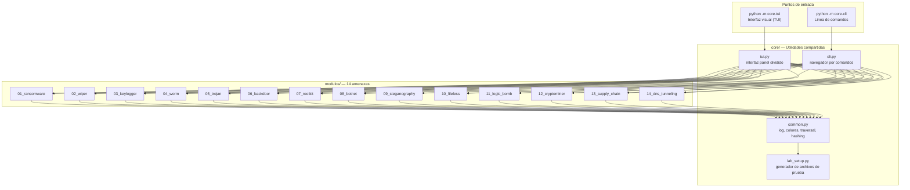
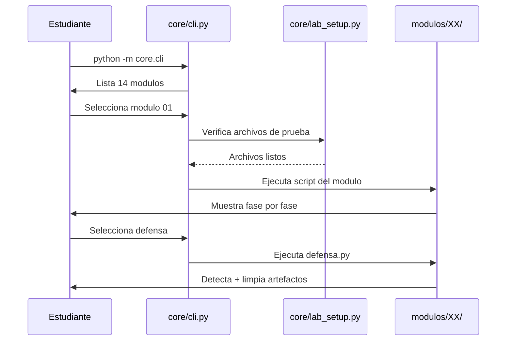
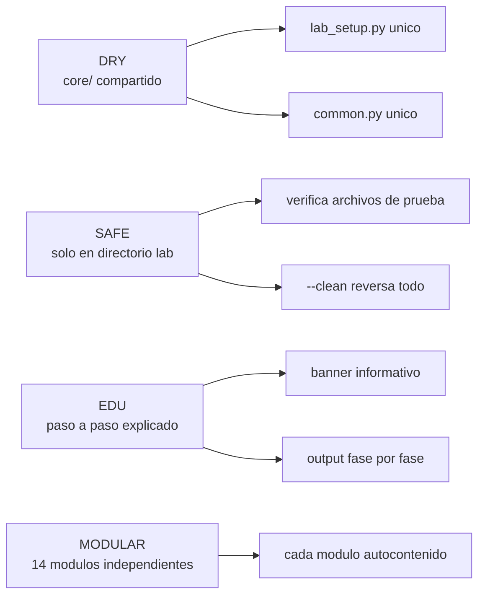

# Laboratorio de Malware Educativo

Repositorio academico para el estudio de amenazas de seguridad informatica.
14 modulos independientes en Python, cada uno con simulacion, defensa y documentacion.

> **Solo para uso educativo en entorno controlado.**

## Arquitectura del Laboratorio



## Requisitos

- Python 3.7+
- Sin dependencias externas

## Inicio rapido

```bash
# 1. Generar archivos de prueba
python core/lab_setup.py

# 2. Abrir la interfaz visual (recomendado para estudiantes)
python -m core.tui

# 3. O usar el CLI por comandos
python -m core.cli

# 4. Ejecutar un modulo directamente
python modulos/01_ransomware/ransomware.py

# 5. Ejecutar defensa
python modulos/01_ransomware/defensa.py

# 6. Limpiar
python modulos/01_ransomware/ransomware.py --clean
```

## Modulos

| # | Modulo | Tipo de amenaza | Archivos |
| --- | -------- | ----------------- | ---------- |
| 01 | [ransomware](modulos/01_ransomware/) | Cifrado de archivos + rescate | simulacion, defensa, README |
| 02 | [wiper](modulos/02_wiper/) | Corrupcion/eliminacion de datos | simulacion, defensa, README |
| 03 | [keylogger](modulos/03_keylogger/) | Captura de pulsaciones | simulacion, defensa, README |
| 04 | [worm](modulos/04_worm/) | Auto-replicacion en red | simulacion, defensa, README |
| 05 | [trojan](modulos/05_trojan/) | Disfraz + payload oculto | simulacion, defensa, README |
| 06 | [backdoor](modulos/06_backdoor/) | Acceso persistente + C2 | simulacion, defensa, README |
| 07 | [rootkit](modulos/07_rootkit/) | Ocultacion de procesos | simulacion, defensa, README |
| 08 | [botnet](modulos/08_botnet/) | Red de bots + DDoS | simulacion, defensa, README |
| 09 | [steganography](modulos/09_steganography/) | Datos ocultos en imagenes | simulacion, defensa, README |
| 10 | [fileless](modulos/10_fileless/) | Sin archivos en disco | simulacion, defensa, README |
| 11 | [logic_bomb](modulos/11_logic_bomb/) | Payload condicional | simulacion, defensa, README |
| 12 | [cryptominer](modulos/12_cryptominer/) | Mineria CPU fraudulenta | simulacion, defensa, README |
| 13 | [supply_chain](modulos/13_supply_chain/) | Compromiso de dependencias | simulacion, defensa, README |
| 14 | [dns_tunneling](modulos/14_dns_tunneling/) | Exfiltracion via DNS | simulacion, defensa, README |

## Flujo de ejecucion



## Estructura de cada modulo

```text
modulos/XX_nombre/
├── README.md         # Teoria profunda + Mermaid diagrams
├── {nombre}.py       # Codigo educativo ejecutable
└── defensa.py        # Deteccion + mitigacion + limpieza
```

Cada script de simulacion soporta:

- `--help` — muestra ayuda
- `--clean` — elimina artefactos generados

## Principios de diseno



## Uso en aula

1. Clonar el repositorio
2. Ejecutar `python core/lab_setup.py` para generar archivos de prueba
3. Navegar modulos con `python -m core.cli` o ejecutar directamente
4. Cada modulo incluye README con teoria, diagramas Mermaid y bibliografia
5. Al finalizar: `python core/lab_setup.py --clean` para limpiar

## Licencia

MIT — Uso exclusivamente educativo y academico.
