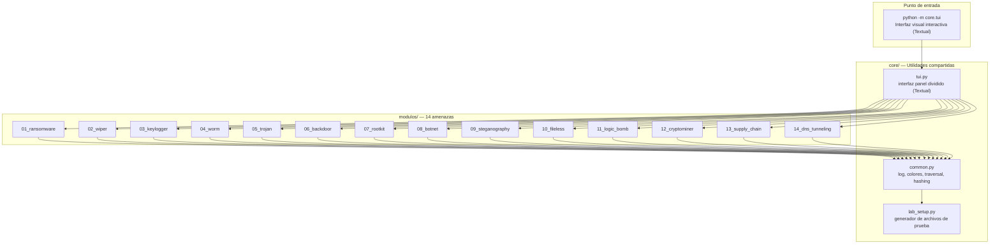
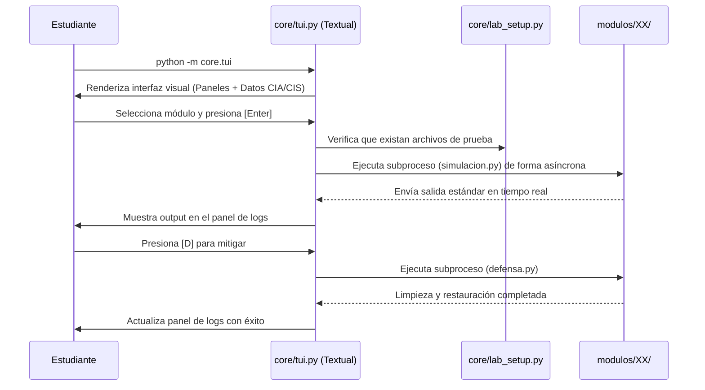
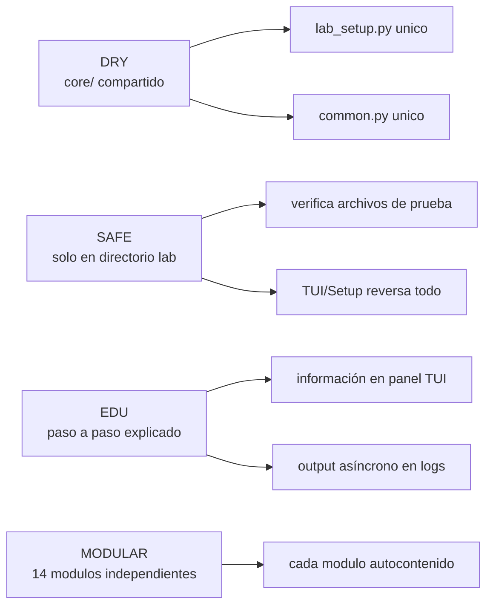

# Laboratorio de Malware Educativo

Repositorio académico para el estudio de amenazas de seguridad informática.
14 módulos independientes en Python, cada uno con simulación, defensa y documentación.

> **Solo para uso educativo en entorno controlado.**

## Arquitectura del Laboratorio



## Requisitos

* Python 3.10+
* `textual`: `pip install textual`

## Inicio rápido

```bash
# 1. Generar archivos de prueba
python core/lab_setup.py

# 2. Abrir la interfaz visual interactiva
python -m core.tui

# 3. Limpiar todo el entorno al finalizar
python core/lab_setup.py --clean

```

## Módulos y Matriz de Gobernanza (CIA vs. CIS)

Cada módulo es autocontenido e incluye el script de emulación (`{nombre}.py`), el script de remediación (`defensa.py`) y su documentación teórica profunda.

| # | Módulo | Vector de Amenaza | Pilar CIA Afectado | Control CIS de Mitigación |
| :--- | :--- | :--- | :---: | :--- |
| **01** | [ransomware](modulos/01_ransomware/) | Cifrado criptográfico de archivos locales | **Disponibilidad** | **CIS 11:** Recuperación de Datos (Backups) |
| **02** | [wiper](modulos/02_wiper/) | Destrucción y corrupción masiva del disco | **Disponibilidad** | **CIS 11:** Resiliencia y Restauración |
| **03** | [keylogger](modulos/03_keylogger/) | Intercepción de periféricos de entrada | **Confidencialidad** | **CIS 05:** Protección de Credenciales |
| **04** | [worm](modulos/04_worm/) | Autoreplicación lateral en red local | **Disponibilidad** | **CIS 12:** Gestión de Infraestructura de Red |
| **05** | [trojan](modulos/05_trojan/) | Ofuscación de carga útil en binario legítimo | **Integridad** | **CIS 02:** Inventario de Activos de Software |
| **06** | [backdoor](modulos/06_backdoor/) | Persistencia oculta y conexión reversa C2 | **Confidencialidad** | **CIS 04:** Gestión de Accesos Seguros |
| **07** | [rootkit](modulos/07_rootkit/) | Evasión por manipulación de llamadas al sistema | **Integridad** | **CIS 10:** Defensas ante Malware (EDR/Heurística) |
| **08** | [botnet](modulos/08_botnet/) | Reclutamiento zombi y orquestación DDoS | **Disponibilidad** | **CIS 13:** Monitoreo y Control de Redes |
| **09** | [steganography](modulos/09_steganography/) | Exfiltración encubierta de datos en medios | **Confidencialidad** | **CIS 03:** Protección de Datos (DLP) |
| **10** | [fileless](modulos/10_fileless/) | Ejecución volátil residente en memoria | **Integridad** | **CIS 10:** Monitoreo del Comportamiento en Memoria |
| **11** | [logic_bomb](modulos/11_logic_bomb/) | Detonación de carga por condición lógica/tiempo | **Disponibilidad** | **CIS 08:** Gestión de Registros de Auditoría |
| **12** | [cryptominer](modulos/12_cryptominer/) | Secuestro y degradación de recursos de CPU | **Disponibilidad** | **CIS 08:** Auditoría y Monitoreo de Procesos |
| **13** | [supply_chain](modulos/13_supply_chain/) | Inyección maliciosa en dependencias | **Integridad** | **CIS 15:** Gestión de Proveedores de Servicio |
| **14** | [dns_tunneling](modulos/14_dns_tunneling/) | Canal encubierto de C2 saltando el Firewall | **Confidencialidad** | **CIS 13:** Filtrado de Conexiones y DNS |

## Flujo de ejecución



## Estructura de cada módulo

```text
modulos/XX_nombre/
├── README.md         # Teoría profunda (Tríada CIA + Controles CIS)
├── {nombre}.py       # Código educativo ejecutable
└── defensa.py        # Detección + mitigación + limpieza

```

Cada script de simulación soporta de forma interna:

* `--help` — muestra ayuda
* `--clean` — elimina artefactos generados

## Principios de diseño



## Uso en aula

1. Clonar el repositorio.
2. Ejecutar `python core/lab_setup.py` para generar el entorno seguro con archivos de prueba.
3. Navegar el laboratorio visual interactivo mediante `python -m core.tui`.
4. Cada módulo cuenta con documentación que profundiza en la teoría del malware, su impacto de gobernanza y bibliografía.
5. Al finalizar la práctica, limpiar el entorno con: `python core/lab_setup.py --clean`.

## Licencia

MIT — Uso exclusivamente educativo y académico
