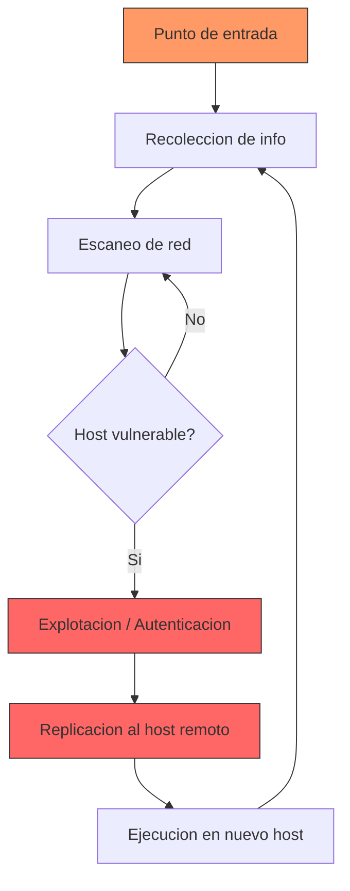

# Modulo 04 - Gusano (Worm)

## 📖 1. Definicion Teorica y Contexto Historico

Un **gusano informatico** (worm) es un programa malware autonomo capaz de replicarse a si mismo y propagarse a traves de redes o medios de almacenamiento sin necesidad de intervencion humana ni de un archivo hospedero. A diferencia de un virus, un gusano no necesita modificarse a si mismo ni adjuntarse a un archivo existente: es un programa completo que se ejecuta de forma independiente.

### Mecanismo fundamental

El gusano combina dos capacidades criticas:

1. **Replicacion**: Crea copias identicas de si mismo en otros sistemas o directorios.
2. **Propagacion**: Utiliza un vector de transmision (red, USB, email) para llegar a nuevos hosts.

Estas capacidades le permiten expandirse de forma exponencial, similar a una epidemia biologica. Cada nodo infectado se convierte en un nuevo punto de dispersion, creando un efecto de cascada.

### Ejemplos historicos relevantes

| Ano | Nombre | Vector de propagacion | Impacto |
|-----|--------|----------------------|---------|
| 1988 | Morris Worm | Exploits en fingerd, rsh, sendmail | Primer worm de la historia; infecto ~6.000 sistemas (10% de Internet) |
| 2000 | ILOVEYOU | Email con adjunto VBS | Destruyo archivos, causo ~$10 mil millones en danos globales |
| 2003 | Blaster / Sasser | Exploit DCOM RPC (MS03-026) | Reiniciaba PCs indefinidamente, propagacion masiva |
| 2008 | Conficker | SMB (MS08-067) + fuerza bruta | Infecto millones de PCs en 190+ paises |
| 2010 | Stuxnet | USB + exploits zero-day LNK + print spooler | Destruyo centrifugadoras de Iran; primer worm de ciberfisico |
| 2017 | WannaCry | EternalBlue (MS17-010) | 200.000+ victimas en 150 paises; cifrado + propagacion |

### WannaCry: un caso de estudio

En mayo de 2017, WannaCry exploto globalmente aprovechando EternalBlue, una vulnerabilidad en el protocolo SMBv1 de Microsoft. El gusano:

1. Escaneaba hosts en la red local buscando el puerto 445 (SMB) abierto.
2. Explotaba la vulnerabilidad para ejecutar codigo arbitrario.
3. Instalaba un cifrador que bloqueaba archivos con extensiones .WNCRY.
4. Demandaba un rescate en Bitcoin por la clave de descifrado.

La propagacion fue tan rapida que afecto al Servicio Nacional de Salud del Reino Unido (NHS), Telefonica, FedEx, y miles de organizaciones en todo el mundo. La propagacion solo se detuvo cuando un investigador descubrio un "kill switch" accidental en el codigo del gusano.

## ⚙️ 2. Mecanismo de Funcionamiento Tecnologico (Flujo Logico)

El flujo tipico de un gusano de red se describe en los siguientes pasos:

1. **Punto de entrada**: El gusano ingresa al sistema initial a traves de un vector (email, exploit USB, descarga maliciosa).

2. **Recoleccion de informacion**: Enumera las interfaces de red, tablas de enrutamiento, archivos de configuracion de red y credenciales almacenadas.

3. **Escaneo de red**: Busca hosts activos probando puertos comunes (SMB 445, SSH 22, RPC 135, RDP 3389) en subredes locales y rutas configuradas.

4. **Explotacion / Autenticacion**: Para cada host vulnerable, explota una falla de seguridad o utiliza credenciales por defecto/robadas para obtener acceso.

5. **Replicacion**: Copia su codigo al host remoto usando el mecanismo de transferencia (SMB, SCP, HTTP).

6. **Ejecucion**: El gusano se ejecuta en el nuevo host, reiniciando el ciclo desde el paso 2.

7. **Persistencia** (opcional): Algunos gusanos modifican claves de registro, tareas programadas o scripts de inicio para sobrevivir reinicios.



### Patron de propagacion

```
   Ronda 0          Ronda 1            Ronda 2
   [A] ──────────> [A]──>[B]
                    [A]──>[C]
                              [A]──>[B]──>[D]
                              [A]──>[B]──>[E]
                              [A]──>[C]──>[F]
                              [A]──>[C]──>[G]
```

Cada nodo infectado se convierte en un nuevo vector de dispersion, generando crecimiento exponencial si no hay contencion.

## 🔺 3. Alineacion con la Triada CIA

* **Pilar Afectado: Disponibilidad (Availability)**
* **Justificacion Tecnica:** El gusano compromete la disponibilidad de multiples maneras:
  - **Consumo de recursos**: La replicacion consume CPU, memoria y ancho de banda, degradando el rendimiento del sistema.
  - **Consumo de red**: El escaneo y la replicacion saturan el ancho de banda de la red, provocando latencia o caidas en la conectividad.
  - **Interrupcion de servicios**: WannaCry, por ejemplo, dejó inoperativo el Servicio Nacional de Salud del Reino Unido, impidiendo acceso a historiales clinicos y cancelando cirugias.
  - **Reinicios forzados**: Algunos gusanos (Blaster, Sasser) provocaban reinicios ciclicos, haciendo imposible usar el equipo.
  - **Denegacion de servicio accidental**: Aunque no sea su objetivo primario, la propagacion masiva puede causar una DoS accidental al saturar servidores y redes.

## 🛡️ 4. Mitigacion bajo la Norma de Controles CIS

* **CIS Control 13: Defensa de Red (Network Monitoring and Defense)**
* **Concepto:** Este control establece la necesidad de monitorear y defender la red contra accesos no autorizados, trafico anomalo y amenazas de propagacion. Incluye la segmentacion de red, el monitoreo de trafico y la respuesta automatizada a incidentes.
* **Implementacion Practica en Laboratorio:** El script `monitoreo_de_red.py` implementa este control de las siguientes formas:
  - **Deteccion de artefactos de propagacion**: Escanea todos los directorios compartidos en busca de copias del gusano, identificando cada nodo infectado y las rutas de transmision.
  - **Grafo de propagacion**: Reconstruye el arbol de infeccion mostrando que nodo origino la infeccion de que otro nodo, similar a como un analista de SOC reconstruiria un evento de propagacion real.
  - **Limpieza automatizada**: Elimina todas las copias del gusano y los directorios compartidos comprometidos, restaurando el estado original.
  - **Registro forense**: Genera un log con hashes SHA-256 de cada artefacto detectado para analisis posterior.

## 🚀 5. Detalles de la Simulacion Educativa (Python)

* **Que hace `worm.py`:**
  1. Crea 3 directorios simulados (`shareA`, `shareB`, `shareC`) que representan nodos de red compartidos.
  2. Genera un archivo `worm_sim.py` en el nodo origen (`shareA`) con un marcador de payload educativo.
  3. Ejecuta 3 rondas de propagacion: en cada ronda, cada nodo infectado intenta copiar el gusano a nodos aun no infectados.
  4. Registra cada paso de propagacion mostrando origen, destino y hash SHA-256 de cada copia.
  5. Muestra un grafo visual de la propagacion y estadisticas finales.
  6. Todo operan dentro de `directorio_pruebas/` (lab_tmp/) sin tocar archivos del sistema real.

* **Que hace `monitoreo_de_red.py`:**
  1. Escanea todos los subdirectorios buscando archivos con el nombre `worm_sim.py`.
  2. Para cada copia encontrada, extrae el hash SHA-256 y el nodo de origen desde el contenido del archivo.
  3. Reconstruye y muestra el grafo de propagacion (que nodo infecto a que otro).
  4. Busca marcadores `WORM_PAYLOAD_SIMULATION` en archivos del laboratorio.
  5. Elimina todas las copias del gusano y los directorios compartidos.
  6. Muestra recomendaciones de defensa: firewalls SMB, IDS/IPS, segmentacion de red, parchado.

### Cuándo aplicar esta defensa

- **Multiples copias de un mismo archivo en la red**: Cuando se detecta que un archivo identico (mismo hash SHA-256) aparece en multiples directorios compartidos o nodos de red, esto indica propagacion automatica caracteristica de un gusano
- **Escaneo de puertos en logs de red**: Alertas de IDS/IPS que muestran un host escaneando multiples puertos (SMB 445, SSH 22, RDP 3389) en rangos de IP de la red local — el patron tipico de reconocimiento de un gusano
- **Consumo inusual de ancho de banda**: Monitoreo de red que detecta un incremento dramatico en el trafico entre hosts de la red local, especialmente en protocolos de transferencia de archivos
- **Deteccion de marcadores de payload**: Cuando herramientas de analisis encuentran firmas conocidas de malware (como `WORM_PAYLOAD_SIMULATION`) en archivos del sistema o compartidos
- **Escenario real**: Un administrador de red detecta que un servidor esta intentando conectarse a cientos de IPs en la subred cada minuto. Un IDS reporta trafico SMB anormal. Se activa la contencion inmediata del gusano

### Por qué funciona esta defensa

- **Segmentacion de red contiene la propagacion**: Si la red esta dividida en segmentos (VLANs) con firewalls entre ellos, un gusano propagandose en un segmento no puede alcanzar los demas, limitando el dano alarea de propagacion
- **IDS/IPS detecta patrones de escaneo**: Los sistemas de deteccion de intrusiones identifican el patron de escaneo de puertos caracteristico de los gusanos (multiples conexiones TCP a puertos comunes en corto tiempo) y generan alertas que permiten la contencion temprana
- **Parchado elimina el vector de explotacion**: La mayoria de gusanos explotan vulnerabilidades conocidas con parches disponibles. El parchado oportuno (control CIS 7) elimina la superficie de ataque, haciendo que el gusano no pueda propagarse
- **Monitoreo reconstruye la cadena de infeccion**: La reconstruccion del grafo de propagacion permite identificar el nodo cero (primer infectado) y trazar la ruta completa de la infeccion, facilitando la limpieza sistematica

### Ejercicios practicos de defensa

1. **Simular y observar la propagacion**: Ejecuta `python worm.py` y observa como el gusano se replica en 3 rondas a traves de los directorios compartidos (shareA, shareB, shareC). Documenta el patron de propagacion: cuantos nodos se infectaron en cada ronda y por que el crecimiento es exponencial
2. **Reconstruccion forense del grafo**: Ejecuta `python monitoreo_de_red.py` para detectar todas las copias del gusano. Analiza el grafo de propagacion generado: identifica el nodo cero, las rutas de transmision, y que hashes corresponden a cada copia. Compara los hashes para confirmar que todas las copias son identicas
3. **Evaluacion de segmentacion de red**: Basandote en el patron de propagacion observado, diseña una arquitectura de red segmentada para una oficina con 3 departamentos (ventas, TI, contabilidad). Define que segmentos necesitan comunicarse entre si y donde colocar firewalls para contener un gusano similar al simulado

---
> **Disclaimer:** Este modulo es estrictamente educativo. Los archivos generados son texto plano inofensivo. No se realizan conexiones de red reales ni se explotan vulnerabilidades verdaderas.
