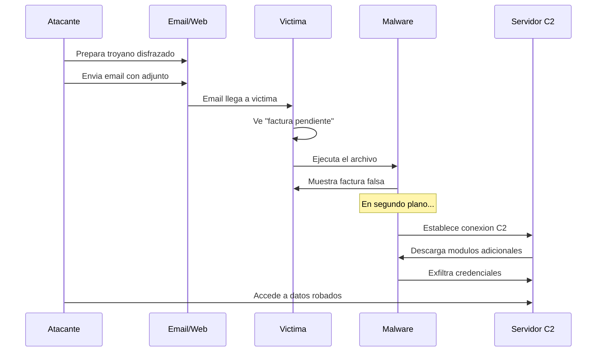

# Modulo 05 - Troyano (Trojan)

## 📖 1. Definicion Teorica y Contexto Historico

Un **troyano informatico** (trojan) es un tipo de malware que se disfraza de software legitimo o util para engañar al usuario y persuadirlo de ejecutarlo. A diferencia de un virus o gusano, un troyano no se replica a si mismo: depende completamente de la ingenieria social para su propagacion.

### Diferencia fundamental con otros malware

| Caracteristica | Virus | Gusano | Troyano |
|----------------|-------|--------|---------|
| Se replica | Si (requiere hospedero) | Si (autonomo) | **No** |
| Necesita accion del usuario | Si (abrir archivo) | No | **Si (ejecutar)** |
| Propagacion automatica | No | Si | **No** |
| Se disfraza | No necesariamente | No | **Si (siempre)** |

### Nombres de origen

El nombre proviene del **Caballo de Troya** de la mitologia griega: los aqueos dejaron un caballo de madera enorme frente a las puertas de Troya como supuesta ofrenda a los dioses. Los troyanos lo aceptaron sin sospechar y lo arrastraron dentro de sus murallas. Durante la noche, soldados griegos ocultos dentro del caballo salieron y abrieron las puertas, permitiendo el ejercito griego conquerir la ciudad.

En informatica, el troyano funciona de manera similar: el usuario cree estar ejecutando algo util (una imagen, una factura, una actualizacion) pero en realidad esta ejecutando codigo malicioso.

### Ejemplos historicos relevantes

| Ano | Nombre | Vector de entrega | Payload oculto |
|-----|--------|-------------------|----------------|
| 2007 | Zeus (Zbot) | Email phishing con adjunto | Robo de credenciales bancarias via keylogging |
| 2013 | Emotet | Email con enlace o adjunto | Descargador de otros malware (modular) |
| 2018 | Emotet v3 | Documentos Word con macros | Robo de credenciales + propagacion lateral |
| 2019 | Agent Tesla | Email con adjunto DOC/DOCX | Keylogger + stealer + captura de pantalla |
| 2020 | SolarWinds Sunburst | Compromiso de actualizacion | Backdoor + acceso persistente a la red |

### Troyanos modernos: Emotet

Emotet, activo entre 2014 y 2021, es uno de los ejemplos mas sofisticados de troyano modular. Su ciclo de vida tipico:

1. **Entrega**: Email de phishing que parece un documento bancario o factura.
2. **Ejecucion**: El usuario habilita macros en Word, ejecutando el payload inicial.
3. **Descarga**: Emotet descarga modulos adicionales desde servidores C2.
4. **Robo**: Modulo de keylogger y stealer roba credenciales bancarias.
5. **Propagacion**: Emotet se usa como plataforma para entregar Ryuk (ransomware).
6. **Actualizacion**: Se auto-actualiza para evadir antivirus.

## ⚙️ 2. Mecanismo de Funcionamiento Tecnologico (Flujo Logico)

El flujo tipico de un ataque con troyano se describe en los siguientes pasos:

1. **Preparacion**: El atacante crea un archivo que parece legitimo (ejecutable con icono de documento, nombre sugestivo).

2. **Entrega**: El archivo se distribuye por email, descarga web, redes sociales o medios removibles.

3. **Ingenieria social**: El nombre y apariencia del archivo generan confianza o urgencia:
   - "factura_pendiente_2026.pdf.exe" (urgencia financiera)
   - "imagen_familia.jpg.exe" (curiosidad personal)
   - "update_flash_player.exe" (necesidad tecnica)

4. **Ejecucion**: El usuario ejecuta el archivo, creyendo que es legitimo.

5. **Payload visible**: Se muestra una "factura" o "imagen" falsa para despistar.

6. **Payload oculto**: En segundo plano, el malware:
   - Instala persistencia (claves de registro, tareas programadas)
   - Establece conexion C2 con el servidor del atacante
   - Comienza a robar datos o descargar modulos adicionales

## 🔺 3. Alineacion con la Triada CIA

* **Pilar Afectado: Integridad (Integrity)**
* **Justificacion Tecnica:** El troyano compromete la integridad de multiples maneras:
  - **Codigo no autorizado**: El troyano introduce codigo malicioso en el sistema que el usuario no autorizo, modificando el comportamiento esperado del equipo.
  - **Archivos modificados**: Puede alterar archivos del sistema, configuraciones y datos del usuario sin su conocimiento.
  - **Credenciales comprometidas**: Al robar contrasenas, el atacante puede modificar cuentas, cambiar configuraciones y alterar datos en sistemas legítimos.
  - **Falsa confianza**: La naturaleza engañosa del troyano crea un entorno donde el usuario cree que su sistema esta limpio cuando en realidad esta comprometido, lo que invalida toda verificacion manual de integridad.
  - **Cadena de suministro**: Como visto en SolarWinds, los troyanos pueden comprometer actualizaciones de software legitimo, afectando la integridad de la cadena de distribucion.

## 🛡️ 4. Mitigacion bajo la Norma de Controles CIS

* **CIS Control 7: Continuidad del Suministro (Email and Web Browser Protections)**
* **Concepto:** Este control establece que las organizaciones deben proteger los sistemas de correo electronico y navegadores web, que son los vectores de entrega principales para troyanos. Incluye proteccion contra phishing, inspeccion de adjuntos, y verificacion de la legitimidad de archivos descargados.
* **Implementacion Practica en Laboratorio:** El script `defensa.py` implementa este control de las siguientes formas:
  - **Deteccion de extensiones duales**: Identifica archivos con doble extension (ej: `.pdf.exe`, `.jpg.exe`) que son el sello clasico de un troyano.
  - **Analisis de marcadores de payload**: Escanea el contenido de archivos buscando indicadores de compromiso (marcadores de payload, direcciones C2).
  - **Verificacion de nombres sospechosos**: Detecta nombres tipicos de troyanos (update.exe, setup.exe, invoice.pdf.exe).
  - **Limpieza automatizada**: Elimina todos los artefactos detectados y genera un informe.

## 🚀 5. Detalles de la Simulacion Educativa (Python)

* **Que hace `trojan.py`:**
  1. Crea 5 archivos troyano simulados dentro de `directorio_pruebas/`:
     - `update.exe` — disfraz de actualizacion del sistema
     - `imagen.jpg.exe` — ejecutable disfrazado de imagen (extension dual)
     - `factura_2026.pdf.exe` — documento falso con payload
     - `README.txt` — archivo de texto con payload de descarga embebido
     - `config.ini` — configuracion con marcadores C2 simulados
  2. Muestra un analisis de deteccion explicando que senales indicarian un troyano real.
  3. Incluye marcadores (`TROJAN_PAYLOAD_SIMULATION`, `C2_SERVER_ENDPOINT`) para que la defensa los detecte.
  4. Cada archivo contiene comentarios didacticos que explican la tecnica de disfraz utilizada.

* **Que hace `defensa.py`:**
  1. Escanea archivos buscando marcadores de payload (`TROJAN_PAYLOAD_SIMULATION`, `C2_SERVER_ENDPOINT`).
  2. Detecta nombres sospechosos y extensiones ejecutables.
  3. Identifica extensiones multiples (disfraz de troyano).
  4. Muestra hallazgos con hash SHA-256 de cada archivo.
  5. Elimina todos los artefactos detectados.
  6. Muestra recomendaciones de defensa: mostrar extensiones reales, verificar firmas, no abrir adjuntos no solicitados.

---
> **Disclaimer:** Este modulo es estrictamente educativo. Los archivos generados son texto plano inofensivo que no contiene codigo malicioso ejecutable. Los marcadores simulan indicadores de compromiso para fines de demostracion.
