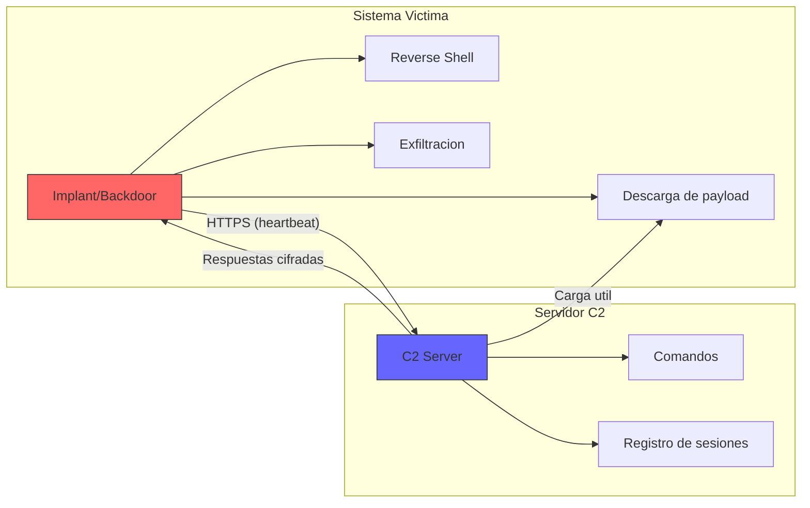

# Modulo 06 - Puerta Trasera (Backdoor)

## 📖 1. Definicion Teorica y Contexto Historico

Una **puerta trasera** (backdoor) es un mecanismo de acceso remoto que permite a un atacante comunicarse con un sistema comprometido sin pasar por los canales de autenticacion normales. A diferencia de un troyano, que se centra en la entrega inicial, la backdoor se enfoca en el **mantenimiento de acceso** a largo plazo.

### Concepto fundamental

Una backdoor actua como una "puerta de servicio" en el sistema comprometido:

- **Canal de comunicacion**: Establece una conexion persistente con el servidor de comando y control (C2) del atacante.
- **Autenticacion oculta**: Permite al atacante autenticarse sin credenciales legitimas.
- **Persistencia**: Sobrevive reinicios y actualizaciones del sistema.
- **Evacion**: Utiliza puertos y protocolos que parecen legitimos (HTTPS, DNS).

### Tipos de backdoors

- **Reverse shell**: La victima se conecta activamente al servidor del atacante, evitando firewalls de entrada.
- **Bind shell**: Abre un puerto en la victima al que el atacante se conecta.
- **Web shell**: Script web (PHP, ASP) que permite ejecutar comandos via HTTP.
- **C2 (Command and Control)**: Framework centralizado que gestiona multiples victimsas.

### Ejemplos historicos relevantes

| Ano | Nombre | Tipo | Descripcion |
|-----|--------|------|-------------|
| 2010 | Stuxnet | Rootkit + C2 | Control de centrifugadoras iranies via PLC |
| 2016 | VPNFilter | C2 multi-etapa | Comprometio 500.000+ dispositivos IoT en 54 paises |
| 2019 | Maze | Ransomware + C2 | Exfiltracion de datos antes de cifrar (doble extortion) |
| 2020 | SolarWinds Sunburst | Supply chain + C2 | Backdoor en actualizaciones de Orion; comprometio agencias de EEUU |
| 2021 | Cobalt Strike | Framework C2 | Herramienta legitima usada como backdoor por atacantes |

### SolarWinds: el ejemplo mas devastador

En diciembre de 2020, se descubrio que el grupo APT29 (Cozy Bear, atribuido a Russia) comprometio la cadena de suministro de SolarWinds:

1. Inyectaron codigo malicioso en la actualizacion de Orion (SUNBURST).
2. 18.000+ organizaciones instalaron la actualizacion comprometida.
3. Solo seleccionaron ~100 objetivos de alto valor (agencias gubernamentales).
4. La backdoor permanecio oculta durante 9 meses.
5. Utilizaron HTTPS para comunicarse con el C2, camuflado como trafico legitimo.

## ⚙️ 2. Mecanismo de Funcionamiento Tecnologico (Flujo Logico)

El flujo tipico de una backdoor con C2 se describe en los siguientes pasos:

1. **Instalacion**: El atacante obtiene acceso inicial (phishing, exploit, supply chain).

2. **Implantacion**: Instala el implant backdoor en el sistema victim.

3. **Beacon**: El implante establece una conexion periodica (heartbeat) con el servidor C2:
   ```
   [Implant] ──── heartbeat (30s) ────> [C2 Server]
   [Implant] <─── comando ──────────── [C2 Server]
   ```

4. **Comando**: El atacante envia instrucciones a traves del C2:
   - `shell`: Abrir reverse shell interactiva
   - `download`: Descargar archivos del sistema victim
   - `upload`: Subir herramientas adicionales
   - `screenshot`: Capturar pantalla
   - `persist`: Instalar persistencia adicional

5. **Exfiltracion**: Los datos robados se envian al C2 via el canal cifrado.

6. **Movilidad lateral**: El atacante usa el sistema comprometido para llegar a otros sistemas en la red.



### Estrategia de evasion

| Tecnica | Descripcion |
|---------|-------------|
| Canales legitimos | Comunica via HTTPS (443) o DNS (53) |
| Jitter | Varia el intervalo de heartbeat para evitar deteccion temporal |
| Encriptacion | Usa AES-256-GCM o RSA para cifrar el trafico C2 |
| Domain Fronting | Se camufla detras de dominios legítimos (CDN) |
| DNS over HTTPS | Oculta las consultas DNS en trafico HTTPS |

## 🔺 3. Alineacion con la Triada CIA

* **Pilar Afectado: Confidencialidad (Confidentiality)**
* **Justificacion Tecnica:** La puerta trasera compromete la confidencialidad de multiples maneras:
  - **Acceso no autorizado**: El atacante tiene acceso remoto a archivos, procesos y datos del sistema sin autorizacion del propietario.
  - **Exfiltracion de datos**: A traves del canal C2, el atacante puede copiar archivos sensibles, credenciales, documentos y propiedad intelectual.
  - **Intercepcion**: Puede capturar teclas presionadas (keylogging), capturar pantallas y registrar comunicaciones.
  - **Privilegios elevados**: Muchas backdoors obtienen acceso de administrador, dando acceso total a toda la informacion del sistema.
  - **Movilidad lateral**: Un sistema comprometido se usa como punto de salto para acceder a otros sistemas y redes, multiplicando la exposicion de datos.

## 🛡️ 4. Mitigacion bajo la Norma de Controles CIS

* **CIS Control 4: Seguridad de Dispositivos (Secure Configuration of Enterprise Assets and Software)**
* **Concepto:** Este control establece la necesidad de configurar y mantener los dispositivos de empresa con configuraciones seguras, incluyendo la deshabilitacion de servicios innecesarios, el cierre de puertos abiertos y la auditoria periodica de configuraciones. Un sistema correctamente configurado reduce significativamente la superficie de ataque para backdoors.
* **Implementacion Practica en Laboratorio:** El script `auditoria_de_persistencia.py` implementa este control de las siguientes formas:
  - **Deteccion de configuraciones C2**: Analiza archivos JSON en busca de direcciones IP y puertos sospechosos configurados para comunicacion C2.
  - **Deteccion de persistencia**: Identifica archivos de registro (.reg) y scripts de inicio (.bat) que configuran ejecucion automatica.
  - **Deteccion de reverse shell**: Escanea logs en busca de patrones de sesiones de shell remota.
  - **Limpieza automatizada**: Elimina todos los artefactos de backdoor y genera un registro forense.

## 🚀 5. Detalles de la Simulacion Educativa (Python)

* **Que hace `backdoor.py`:**
  1. Crea `c2_config.json` con 3 servidores C2 simulados (IPs ficticias, puertos comunes) y configuracion de persistencia.
  2. Crea `shell_log.txt` con un registro simulado de reverse shell que muestra comandos ejecutados.
  3. Crea `persistence.reg` con claves de registro simuladas para ejecucion automatica.
  4. Crea `startup.bat` con un script de inicio simulado que establece conexion C2.
  5. Muestra un diagrama visual del flujo de comunicacion C2.
  6. **NO** establece conexiones de red reales — todo es texto plano.
  7. **NO** modifica el registro real del sistema — los archivos .reg son solo texto.

* **Que hace `auditoria_de_persistencia.py`:**
  1. Escanea archivos en busca de marcadores `C2_BACKDOOR_SIMULATION` y `SHELL_SIMULATION`.
  2. Analiza archivos JSON buscando IPs y puertos sospechosos configurados como C2.
  3. Detecta archivos de persistencia (.reg, .bat) con patrones de ejecucion automatica.
  4. Muestra hallazgos con hashes y detalles de cada artefacto.
  5. Elimina todos los artefactos detectados.
  6. Muestra recomendaciones de defensa: monitoreo de conexiones salientes, segmentacion de red, listas blancas de aplicaciones.

---
> **Disclaimer:** Este modulo es estrictamente educativo. No se establecen conexiones de red reales. Todos los archivos generados son texto plano inofensivo con marcadores simulados de IOC.
