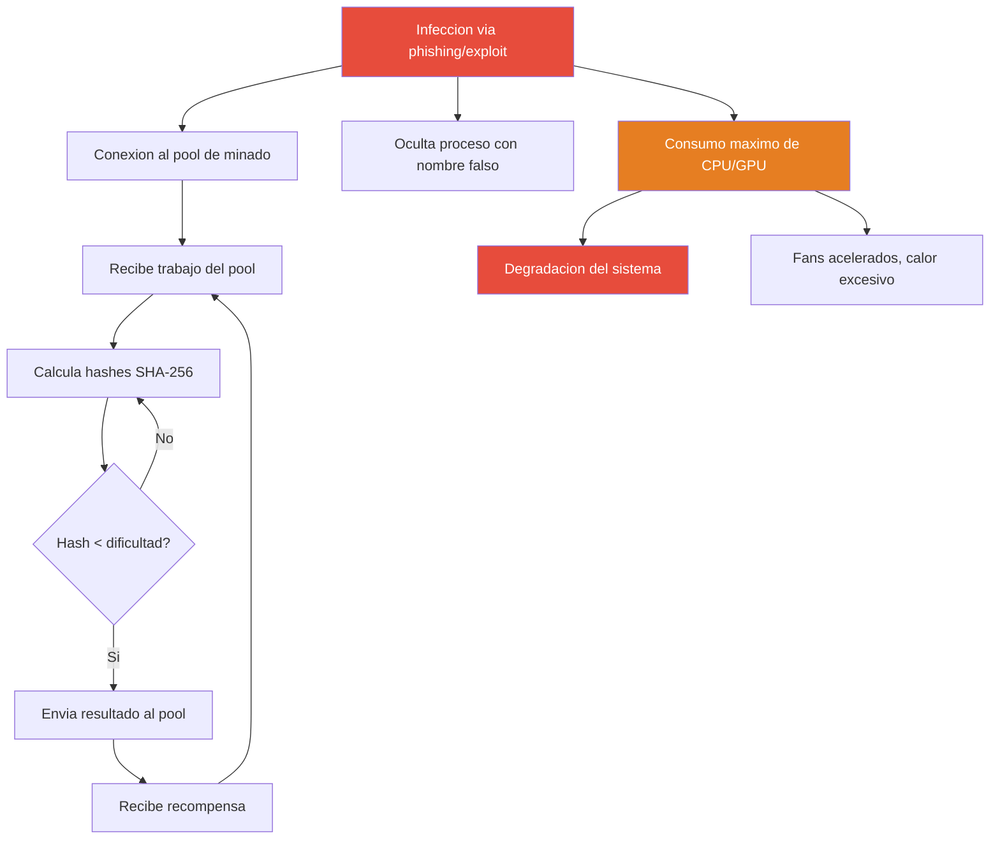

# Modulo 12 - Criptominero (Cryptominer)

## 1. Definicion Teorica y Contexto Historico

Un **criptominero** (o cryptojacker) es un tipo de malware que secuestra los recursos
computacionales de un sistema victima para minar criptomonedas sin el consentimiento
del propietario. A diferencia del ransomware, que busca un rescate directo, el
criptominero genera ganancias continuas para el atacante mientras permanezca oculto.

### Algoritmo de minado: Proof of Work (PoW)

El minado de criptomonedas como Bitcoin y Monero se basa en el algoritmo **Proof of
Work (PoW)**, que requiere que el minero encuentre un valor (nonce) tal que el hash
SHA-256 del bloque sea menor que un umbral de dificultad. Esto significa que el hash
debe comenzar con un numero determinado de ceros. El proceso es intensivo en CPU/GPU
porque implica calcular millones de hashes por segundo hasta encontrar uno valido.

### Contexto historico y ataques notorios

| Ano | Nombre | Descripcion |
|-----|--------|-------------|
| 2017 | Coinhive | Servicio JavaScript que minaba Monero en el navegador de visitantes. Infecto mas de 30,000 sitios web, incluyendo The Pirate Bay. Cerrado en 2019. |
| 2018 | CreativeFan | Minero que se propagaba via exploits de EternalBlue, comprometiendo servidores Windows desactualizados. |
| 2019 | Lemon Duck | Minero de Python que explotaba Redis y Docker, propagandose via CVE-2020-14882. Minaba Monero usando CPU del servidor. |
| 2020 | PowerGhost | Minero fileless que se ejecuta en memoria, propagandose via EternalBlue (MS17-010) e instalando persistencia como servicio. |
| 2021 | 8220 Gang | Grupo de actores maliciosos que针对 vulnerabilities en Oracle WebLogic y Apache para instalar mineros. |
| 2023 | Kinsing | Minero que explotaba vulnerabilidades en contenedores Docker y servidores Linux para minar Monero. |

### Por que es peligroso

- **Disponibilidad**: El minero consume CPU/GPU al 100%, degradando el rendimiento
  del sistema y causando disponibilidad de servicio.
- **Ocultamiento**: Los mineros modernos utilizan tecnicas de ofuscacion, nomenclatura
  de procesos legitimos y persistencia avanzada para evitar la deteccion.
- **Escalabilidad**: Un solo minero comprometido puede propagarse a otros sistemas
  de la red, convirtiendose en un botnet de minado.

---

## 2. Mecanismo de Funcionamiento Tecnologico (Flujo Logico)

1. **Infeccion inicial**: El minero se instala en el sistema via phishing, exploits,
   dependencias comprometidas o drive-by downloads.

2. **Conexion al pool**: El malware establece conexion con un pool de minado (servidor
   que coordina el trabajo entre mineros) usando el protocolo Stratum sobre TCP.

3. **Recepcion de trabajo**: El pool envia al minero un bloque de trabajo que incluye
   la transaccion coinbase, el merkle root y el umbral de dificultad.

4. **Calculo de hashes**: El minero calcula hashes SHA-256 (o RandomX para Monero)
   iterando sobre diferentes valores de nonce hasta encontrar uno que cumpla la
   dificultad requerida.

5. **Envio de resultado**: Cuando encuentra un hash valido, lo envia al pool como
   prueba de trabajo. El pool verifica y otorga una fraccion de recompensa.

6. **Persistencia**: El minero se auto-ejecuta al inicio del sistema via cron,
   systemd, WMI o modificaciones al registro.

7. **Evasion**: Utiliza nombres de proceso similares a procesos del sistema (svchost,
   csrss), ofuscacion de codigo, y ejecucion en memoria para evadir antivirus.

---

## 3. Alineacion con la Triada CIA

* **Pilar Afectado: Disponibilidad (Availability)**

* **Justificacion Tecnica**: El criptominero consume recursos computacionales (CPU,
  GPU, memoria, ancho de banda) al maximo nivel, dejando insuficientes recursos para
  las operaciones normales del sistema. Esto resulta en degradacion de rendimiento,
  tiempos de respuesta elevados, y en casos criticos, caida completa de servicios
  criticos. La disponibilidad se ve comprometida porque el sistema no puede prestar
  el servicio para el cual fue disenido, ya que sus recursos estan siendo utilizados
  por la actividad minera maliciosa.

---

## 4. Mitigacion bajo la Norma de Controles CIS

* **CIS Control 8: Auditoria de Cuentas (Audit Log Management)**

* **Justificacion**: Los registros de auditoria permiten detectar patrones de consumo
  anormal de recursos, procesos sospechosos y conexiones a pools de minado. Un
  sistema de gestion de logs debe capturar eventos de sistema, cambios en procesos
  y actividad de red para que un equipo de seguridad pueda identificar indicadores
  de compromiso (IOCs) de cryptojacking.

* **Implementacion Practica en Laboratorio**: El script `defensa.py` implementa
  auditoria de 6 vectores: (1) monitoreo de uso de CPU via `/proc/loadavg`,
  (2) busqueda de archivos de configuracion de minero, (3) deteccion de codigo
  de minado inyectado en scripts, (4) escaneo de archivos temporales sospechosos
  en `/tmp`, (5) revision de procesos activos contra una lista de mineros conocidos
  (xmrig, minerd, cpuminer, etc.), y (6) analisis de conexiones de red en puertos
  tipicos de minado (3333, 4444, 5555, 8888, 9999).

---

## 5. Detalles de la Simulacion Educativa (Python)

* **Que hace `cryptominer.py`**:
  El script simula el comportamiento completo de un criptominero sin generar danio.
  Copia archivos del laboratorio a `./directorio_pruebas/` y luego ejecuta un
  algoritmo de minado que calcula hashes SHA-256 sobre datos aleatorios. Muestra
  metricas en tiempo real: hashrate (hashes/segundo), dificultad (numero de ceros
  requeridos), nonce, porcentaje de CPU, y bloques encontrados. Genera artefactos
  de prueba: un archivo de configuracion JSON con datos ficticios del pool/wallet,
  un log de estadisticas de minado, y un script temporal que simula actividad
  sospechosa. Todo el proceso es reversble con `--clean`.

* **Que hace `defensa.py`**:
  Implementa un escaneo de deteccion de 6 verificaciones: (1) analisis de uso de CPU
  via `/proc/loadavg`, (2) busqueda de archivos de configuracion de minero en el
  directorio de artefactos, (3) verificacion de integridad de `script.py` buscando
  patrones de codigo de minado inyectado, (4) escaneo de archivos temporales en
  `/tmp` con patrones de minero, (5) inspeccion de procesos activos contra la lista
  de mineros conocidos, y (6) analisis de conexiones de red en puertos tipicos de
  minado. Incluye funcion de limpieza completa con `--clean`.

---

