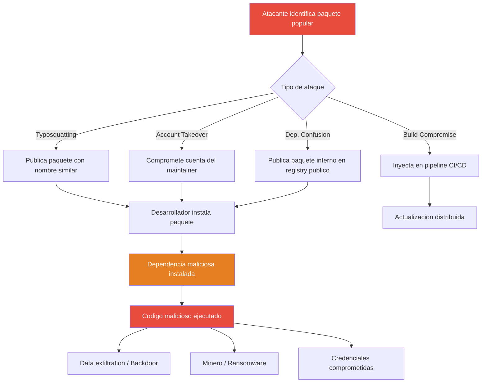

# Modulo 13 - Ataque de Cadena de Suministro (Supply Chain Attack)

## 1. Definicion Teorica y Contexto Historico

Un **ataque a la cadena de suministro** (supply chain attack) es una tecnica en la
que el atacante compromete un componente legitimo del proceso de desarrollo de
software para distribuir malware a usuarios finales que confian en ese componente.
En lugar de atacar directamente al objetivo, el atacante explota la confianza en
herramientas, dependencias o procesos de distribucion.

### Vectores de ataque en cadena de suministro

- **Typosquatting**: Publicar paquetes con nombres similares a los populares
  (ej: `requets` en vez de `requests`) para capturar errores de tipeo.
- **Dependency Confusion**: Publicar en el registry publico un paquete con el mismo
  nombre que un paquete interno de una organizacion, con version mas alta.
- **Account Takeover**: Comprometer la cuenta del maintainer de un paquete popular
  para publicar versiones maliciosas.
- **Build Compromise**: Inyectar codigo malicioso en el proceso de compilacion
  (CI/CD), como en el caso SolarWinds.
- **Maintainer Insider**: Un desarrollador malicioso dentro del equipo de
  desarrollo inserta codigo backdoor.

### Ataques notorios

| Ano | Nombre | Impacto |
|-----|--------|---------|
| 2017 | CCleaner | Backdoor insertada en versions 5.33-5.34, afectando a 2.27 millones de usuarios. |
| 2018 | event-stream | Maintainer comprometido, dependencia flatmap-stream robo credenciales de wallets cryptocurrency. |
| 2020 | SolarWinds (SUNBURST) | Backdoor en actualizaciones de Orion, 18,000+ organizaciones comprometidas incluyendo agencias gubernamentales. |
| 2021 | ua-parser-js | Account takeover, versions comprometidas 0.7.29 y 1.0.0 con minero y credential stealer. |
| 2021 | Log4Shell | Vulnerabilidad en dependencia ubiquitua (Log4j), CVE-2021-44228, CVSS 10.0. |
| 2023 | XZ Utils | Backdoor insertada por maintainer ficticio durante 2 anos, comprometiendo SSH en distribuciones Linux. |

---

## 2. Mecanismo de Funcionamiento Tecnologico (Flujo Logico)

1. **Reconocimiento**: El atacante identifica paquetes populares o dependencias
   internas de la organizacion objetivo.

2. **Preparacion**: Crea paquetes maliciosos con nombres similares (typosquatting)
   o identicos (dependency confusion) a los paquetes legitimos.

3. **Infeccion del registro**: Publica los paquetes maliciosos en registries publicos
   (npm, PyPI, RubyGems) o compromete cuentas de maintainers existentes.

4. **Distribucion**: Los desarrolladores instalan o actualizan dependencias,
   descargando automaticamente el paquete malicioso.

5. **Ejecucion del payload**: El codigo malicioso se ejecuta durante la instalacion
   (post-install scripts) o en tiempo de ejecucion.

6. **Exfiltracion/Backdoor**: El payload roba credenciales, instala backdoors,
   mina criptomonedas o establece comunicacion C2.

7. **Persistencia**: El malware se mantiene en el sistema incluso despues de
   actualizar el paquete, ya que puede haber modificado archivos del sistema.

---

## 3. Alineacion con la Triada CIA

* **Pilar Afectado: Integridad (Integrity)**

* **Justificacion Tecnica**: El ataque a la cadena de suministro compromete la
  integridad del software al modificar dependencias legitimas sin que el desarrollador
  lo detecte. Cuando un paquete malicioso reemplaza o se agrega a una dependencia,
  la integridad del codigo fuente se ve afectada: el software que el desarrollador
  cree que es legitimo en realidad contiene codigo no autorizado. Esto viola la
  integridad porque los datos (codigo fuente, dependencias) han sido modificados
  sin autorizacion, y el sistema no tiene forma de verificar que los componentes
  no han sido alterados.

---

## 4. Mitigacion bajo la Norma de Controles CIS

* **CIS Control 15: Seguridad de Servidores (Service Provider Security)**

* **Justificacion**: Este control establece que las organizaciones deben verificar
  la seguridad de los proveedores de servicios y herramientas que utilizan en su
  cadena de suministro. Incluye la verificacion de integridad de paquetes,
  el uso de lockfiles para fijar versiones, y la auditoria regular de
  dependencias. Las organizaciones deben mantener un SBOM (Software Bill of
  Materials) y verificar hashes de paquetes contra registros oficiales.

* **Implementacion Practica en Laboratorio**: El script `verificacion_de_dependencias_sca.py` implementa
  6 verificaciones: (1) analisis de `requirements.txt` contra lista de paquetes
  maliciosos conocidos y patrones de version anormal, (2) inspeccion de
  `package.json` para dependencias sospechosas, (3) revision de `package-lock.json`
  contra paquetes comprometidos, (4) deteccion de scripts de hook de instalacion
  (post-install, pre-install), (5) verificacion de SBOM con metadatos de ataque,
  y (6) verificacion de integridad de archivos criticos del proyecto.

---

### Cuándo aplicar esta defensa

- **Actualización o instalación de dependencias nuevas:** Después de cada
  `npm install`, `pip install` o actualización de dependencias, ejecutar el
  análisis SCA para verificar que no se han introducido paquetes maliciosos.
  Especialmente crítico cuando se actualizan paquetes de terceros frecuentemente
  utilizados.
- **Alerta de typosquatting en registries públicos:** Cuando un desarrollador
  reporta un paquete con nombre sospechosamente similar a uno legítimo, o
  cuando un scanner de seguridad detecta paquetes no verificados en el
  `requirements.txt` o `package.json`, activar la auditoría completa de
  dependencias.
- **Nuevo colaborador o cambio de maintainers:** Cuando un paquete cambia de
  maintainer o cuando se incorpora un nuevo desarrollador con acceso al
  repositorio, revisar las dependencias del proyecto para detectar posibles
  backdoors o dependencias nuevas no autorizadas.
- **Auditorías de seguridad periódicas:** Ejecutar el análisis SCA como parte
  del pipeline CI/CD en cada commit, especialmente antes de despliegues a
  producción, para detectar cambios en la cadena de suministro.

### Por qué funciona esta defensa

- **Verificación de integridad en múltiples capas:** Al analizar
  `requirements.txt`, `package.json`, `package-lock.json` y scripts de hook
  simultáneamente, se detectan amenazas en cada etapa del proceso de
  instalación de dependencias, no solo al momento de la descarga.
- **Detección de patrones de ataque conocidos:** La comparación contra listas
  de paquetes maliciosos conocidos (flask-utils, enterprise-tool) y patrones de
  version anormal permite identificar ataques de supply chain documentados
  antes de que el payload sea ejecutado.
- **SBOM como línea de defensa:** El Software Bill of Materials proporciona un
  inventario completo de todas las dependencias del proyecto, permitiendo
  rastrear rápidamente qué componentes están comprometidos cuando se publica
  una nueva vulnerabilidad (como Log4Shell).

### Ejercicios prácticos de defensa

1. **Análisis de typosquatting:** Ejecuta `supply_chain.py` y revisa los
   archivos `requirements.txt` y `package.json` generados. Luego ejecuta
   `verificacion_de_dependencias_sca.py` e identifica qué paquetes son
   legítimos y cuáles son typosquatting (ej: `flask-utils` vs `flask`).
2. **Auditoría de hooks de instalación:** Revisa los scripts de hook generados
   por la simulación. Identifica los patrones sospechosos (`exec()`,
   `subprocess`, `os.system`) que el script de defensa detecta. Compara con
   hooks legítimos de paquetes populares.
3. **Verificación de SBOM:** Analiza el SBOM generado y verifica que contiene
   los metadatos de tipo de ataque. En un entorno real, este SBOM se usaría
   para cumplir con regulaciones de seguridad de software y para responder
   rápidamente a nuevas CVEs afectando dependencias del proyecto.

## 5. Detalles de la Simulacion Educativa (Python)

* **Que hace `supply_chain.py`**:
  El script simula un ataque completo a la cadena de suministro. Copia archivos del
  laboratorio a `./directorio_pruebas/` y genera manifest de dependencias falsas:
  `requirements.txt` con paquetes Python (flask-utils, enterprise-tool) y
  `package.json` con paquetes Node.js (event-stream, ua-parser-js). Demuestra
  cuatro tecnicas: typosquatting (nombres similares), dependency confusion (paquetes
  internos publicados), account takeover (compromiso de maintainer), y build
  compromise (SolarWinds-style). Genera un SBOM (Software Bill of Materials) falso
  que incluye metadatos de tipo de ataque. Todo es reversble con `--clean`.

* **Que hace `verificacion_de_dependencias_sca.py`**:
  Implementa un escaneo de 6 verificaciones: (1) analisis de `requirements.txt`
  buscando paquetes maliciosos conocidos (flask-utils, enterprise-tool) y patrones
  de version anormal, (2) inspeccion de `package.json` para dependencias con
  sufijos maliciosos, (3) revision de `package-lock.json` contra paquetes
  comprometidos, (4) deteccion de scripts de hook de instalacion con patrones
  sospechosos (exec, subprocess, os.system), (5) verificacion de SBOM con
  metadatos de tipo de ataque, y (6) verificacion de integridad de archivos
  criticos. Incluye funcion de limpieza con `--clean`.

---

