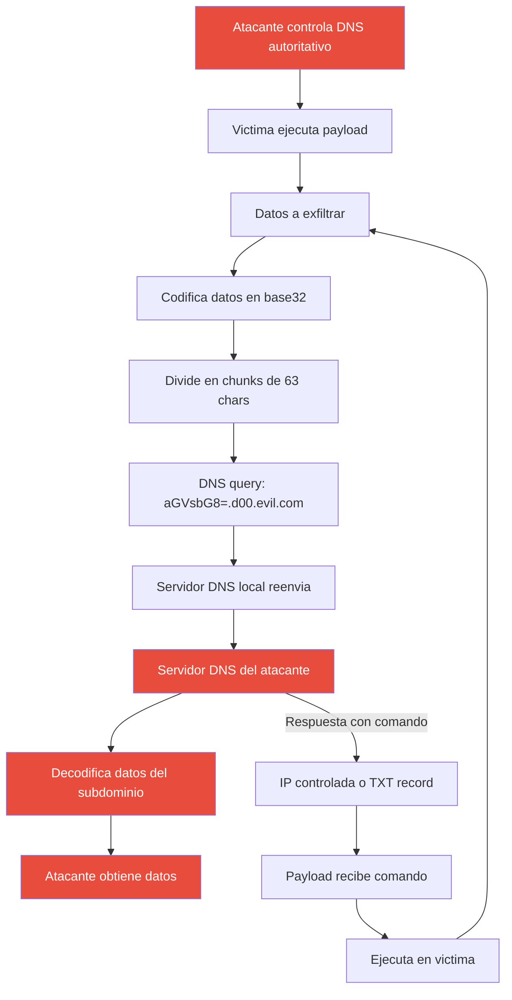

# Modulo 14 - DNS Tunneling

## 1. Definicion Teorica y Contexto Historico

El **DNS Tunneling** es una tecnica de exfiltracion de datos y comunicacion
Command and Control (C2) que codifica la informacion dentro de consultas DNS
aparentemente normales. Dado que el DNS es un protocolo esencial para el
funcionamiento de cualquier red, rara vez se bloquea completamente, lo que lo
convierte en un canal ideal para eludir firewalls y sistemas de deteccion.

### Como funciona el tunel DNS

En un ataque de DNS tunneling, el atacante controla un servidor DNS autoritativo
que recibe las consultas de la victima. Los datos se codifican en los subdominios
de las consultas DNS (labels), que pueden contener hasta 63 caracteres cada uno.
El servidor del atacante decodifica estas consultas para recuperar los datos
exfiltrados, y puede enviar comandos de retorno codificados en las respuestas DNS.

### Herramientas reales de DNS tunneling

| Herramienta | Plataforma | Metodo | Velocidad |
|------------|-----------|--------|-----------|
| iodine | Linux/macOS/Windows | Codifica en subdominios A/TXT | ~200 Kbps |
| dnscat2 | Linux/macOS/Windows | Canales cifrados via DNS | Variable |
| DNSExfiltrator | Windows (PowerShell) | Exfiltracion via subdominios | Lento |
| Iodine-ng | Linux | Tunnel IPv4 sobre DNS | ~300 Kbps |
| Dnscat | Linux | Tunel bidireccional cifrado | Variable |

### Por que el DNS es dificil de bloquear

- **Infraestructura critica**: DNS es esencial para el funcionamiento de la red
- **Puerto 53 siempre abierto**: Firewalls raramente bloquean el DNS
- **Protocolo legitimo**: El trafico DNS se ve normal en logs de red
- **Codificacion en subdominios**: Los datos caben en la consulta (63 bytes/label)
- **UDP**: Sin estado, dificil de rastrear sesiones
- **Baja frecuencia**: Las consultas DNS son poco frecuentes y cortas

### Ataques notorios

| Ano | Nombre | Descripcion |
|-----|--------|-------------|
| 2016 | OilRush | Grupo APT irani que uso DNS tunneling para exfiltrar datos de organizaciones energeticas. |
| 2017 | DNSMessenger | Malware que usaba TXT records para comunicacion C2 via DNS. |
| 2019 | ROPIRUN | Trafico masivo de DNS como mecanismo de propagacion de malware. |
| 2020 | DNSpionage | Campana APT que uso DNS tunneling para robar credenciales de VPN y correo. |
| 2023 | BPFDoor | Malware que evadia firewalls usando tunneles DNS para mantener acceso persistente. |

---

## 2. Mecanismo de Funcionamiento Tecnologico (Flujo Logico)

1. **Instalacion del payload**: El malware se instala en el sistema victima y
   comienza a generar consultas DNS al dominio controlado por el atacante.

2. **Codificacion de datos**: Los datos a exfiltrar (credenciales, archivos,
   comandos) se codifican en base32 o base64 para ser seguros en DNS.

3. **Division en chunks**: Los datos codificados se dividen en fragmentos de
   maximo 63 caracteres (limite de un label DNS).

4. **Consulta DNS**: Cada chunk se envia como subdominio de una consulta:
   `[chunk].d00.evil-server.com`

5. **Recepcion en C2**: El servidor DNS autoritativo del atacante recibe la
   consulta, extrae el subdominio, y decodifica los datos.

6. **Respuesta C2**: El servidor responde con una IP controlada o un registro
   TXT que contiene comandos codificados para la victima.

7. **Ejecucion de comandos**: La victima decodifica la respuesta y ejecuta
   los comandos recibidos, enviando los resultados via nuevas consultas DNS.

---

## 3. Alineacion con la Triada CIA

* **Pilar Afectado: Confidencialidad (Confidentiality)**

* **Justificacion Tecnica**: El DNS tunneling compromete la confidencialidad al
  exfiltrar datos sensibles (credenciales, archivos, informacion proprietaria)
  a traves de un canal que se infiltra como trafico DNS legitimo. Los firewalls
  y sistemas de deteccion tipicamente permiten el DNS (puerto 53), por lo que
  los datos exfiltrados escapan de los controles de seguridad perimetral. Ademas,
  el canal C2 bidireccional permite al atacante ejecutar comandos remotos en el
  sistema victima, accediendo a informacion que no deberia ser accesible externamente.

---

## 4. Mitigacion bajo la Norma de Controles CIS

* **CIS Control 13: Defensa de Red (Network Monitoring and Defense)**

* **Justificacion**: El monitoreo de red es esencial para detectar trafico DNS
  anomalo que pueda indicar tunneling. Este control establece que las
  organizaciones deben monitorear el trafico de red en busca de patrones
  sospechosos, incluyendo subdominios inusualmente largos, alta frecuencia de
  consultas al mismo dominio, y presencia de codificacion (base32/base64) en
  consultas DNS.

* **Implementacion Practica en Laboratorio**: El script `deteccion_de_anomalias_dns.py` implementa
  5 verificaciones: (1) busqueda de archivos de logs DNS y scripts payload,
  (2) analisis de contenido de logs DNS buscando trafico tunneled (labels largos,
  dominios .evil, base32), (3) deteccion de scripts con funciones de codificacion
  DNS y dominios C2 hardcodeados, (4) escaneo de subdominios inusualmente largos
  (>30 caracteres) en archivos del proyecto, y (5) deteccion de secuencias base32
  sospechosas en archivos. Herramientas de produccion recomendadas: Suricata
  (reglas DNS tunneling), Zeek/Bro (analisis de trafico DNS), y DNS analytics
  con Machine Learning.

---

### Cuándo aplicar esta defensa

- **Subdominios inusualmente largos (>30 caracteres):** Cuando el análisis de
  logs DNS revela consultas con labels que exceden la longitud normal de
  subdominios (típicamente 5-15 caracteres), es un IOC fuerte de DNS tunneling
  ya que los datos codificados en base32/base64 requieren espacio extra.
- **Alta frecuencia de consultas al mismo dominio:** Si un host realiza decenas
  o cientos de consultas DNS al mismo dominio en un período corto (minutos),
  sugiere que está fragmentando datos para exfiltrarlos a través del canal DNS.
- **Consultas con patrones de codificación:** La presencia de caracteres válidos
  en base32/base64 (A-Z, 2-7, +, /) en subdominios de consultas DNS es un
  indicador de que se están encapsulando datos en el protocolo.
- **Tráfico TXT record anómalo:** Las consultas de tipo TXT son el vector más
  frecuente para DNS tunneling bidireccional. Un volumen inusual de consultas
  TXT hacia un dominio específico activa la inspección profunda.

### Por qué funciona esta defensa

- **Análisis de dimensionalidad anómala:** El DNS tunneling requiere labels más
  largos y más frecuentes que el tráfico DNS legítimo. Al establecer umbrales
  de longitud y frecuencia, se detecta la desviación del comportamiento normal
  sin necesidad de inspeccionar el contenido cifrado de las consultas.
- **Correlación multi-vector:** La combinación de análisis de logs DNS,
  detección de scripts con funciones de codificación y escaneo de patrones
  base32 proporciona visibilidad desde múltiples ángulos, haciendo que la
  evasión sea significativamente más difícil para el atacante.
- **Desarticulación del canal C2:** Al identificar y bloquear el dominio
  utilizado para el tunelDNS, se corta tanto la exfiltración de datos como el
  canal de comandos C2, neutralizando completamente la operación del atacante.

### Ejercicios prácticos de defensa

1. **Análisis de logs DNS:** Ejecuta `dns_tunneling.py` y revisa los logs
   generados en `logs_dns/`. Identifica los chunks codificados en base32 y
   calcula la longitud de los labels. Luego ejecuta
   `deteccion_de_anomalias_dns.py` y verifica que detecta los patrones de
   tunneling.
2. **Detección de dominios C2:** Busca en los archivos generados referencias a
   `evil-server.example.com`. En un entorno real, este dominio se bloquearía
   en el DNS resolver y se agregaría a una lista de Indicators of Compromise
   para bloqueo perimetral.
3. **Prueba de limpieza:** Ejecuta `deteccion_de_anomalias_dns.py --clean` y
   verifica que se eliminan los logs DNS, scripts payload y artefactos de
   tunneling. Luego ejecuta una segunda pasada para confirmar que no quedan
   evidencias de la actividad maliciosa.

## 5. Detalles de la Simulacion Educativa (Python)

* **Que hace `dns_tunneling.py`**:
  El script simula el proceso completo de DNS tunneling sin generar trafico DNS real.
  Copia archivos del laboratorio a `./directorio_pruebas/` y luego codifica un mensaje
  secreto (credenciales, datos del sistema) en base32, lo divide en chunks, y simula
  consultas DNS al dominio `evil-server.example.com`. Muestra cada paso: codificacion,
  envio de chunks con labels largos, simulacion de respuestas del servidor C2, y
  decodificacion. Tambien demuestra un canal C2 bidireccional con comandos simulados
  (whoami, id, hostname). Incluye un panel de deteccion que muestra los indicadores
  que veria un analista de SOC. Genera logs de trafico DNS y un script payload.

* **Que hace `deteccion_de_anomalias_dns.py`**:
  Implementa un escaneo de 5 verificaciones: (1) busqueda de archivos de logs DNS y
  scripts payload en `logs_dns/` y `scripts_dns/`, (2) analisis de contenido de logs
  DNS buscando labels largos, dominios .evil, y secuencias base32 validas, (3) deteccion
  de scripts con funciones de codificacion DNS (`codificar_dns`, `DOMINIO_C2`,
  `base32encode`), (4) escaneo de subdominios largos (>30 chars) en archivos del
  proyecto, y (5) deteccion de secuencias base32 sospechosas (>20 chars). Incluye
  funcion de limpieza con `--clean`.

---

